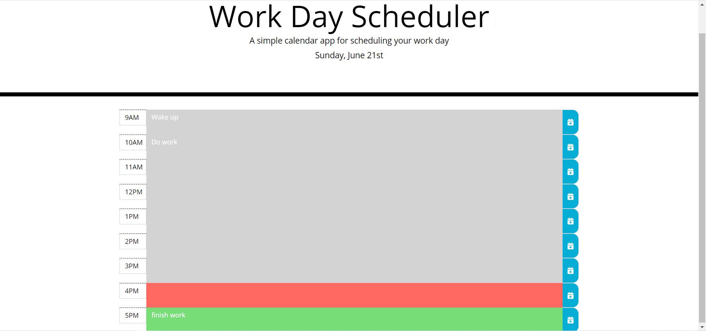

# Work Day Scheduler Starter Code
https://github.com/ZachWagner1/Work-Day-Scheduler
https://zachwagner1.github.io/Work-Day-Scheduler/

A daily work scheduler that you can add tasks to for every hour of the work day. Select the field that you wish to add tasks to and click the blue save button on the right to save the task. Tasks that have already passed with have a gray background. Red background means the task is due within the hour, and green background means the task is upcoming. 